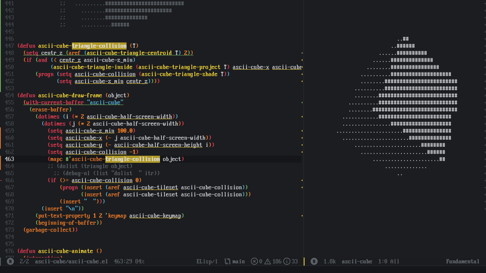
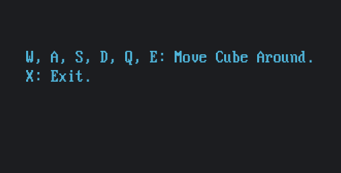

# emacs-ascii-cube

Rotating ASCII cube in Emacs buffer. <br>
Demo: [https://www.youtube.com/watch?v=KTEc1ZExRTU](https://www.youtube.com/watch?v=KTEc1ZExRTU)

# Install

Load ```ascii-cube.el``` or ```ascii-cube.elc``` (byte-compiled for speed).

```
M-x ascii-cube RET
```

# Screenshot


# Controls
<!-- <kbd>W</kbd><kbd>A</kbd><kbd>S</kbd><kbd>D</kbd><kbd>Q</kbd><kbd>E</kbd>: move cube around. <br> -->
<!-- <kbd>x</kbd> to quit. -->



